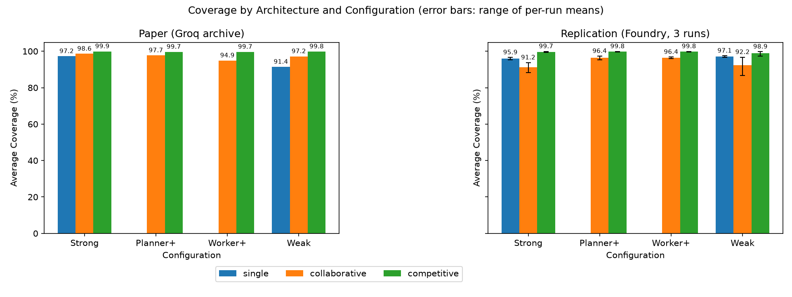
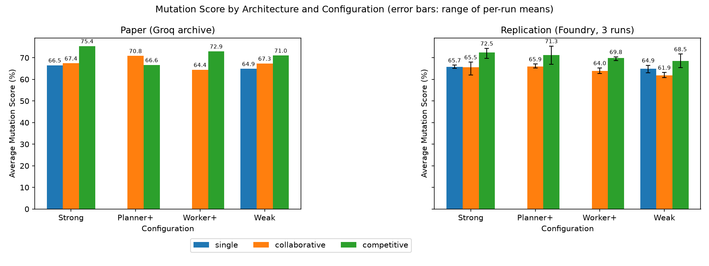
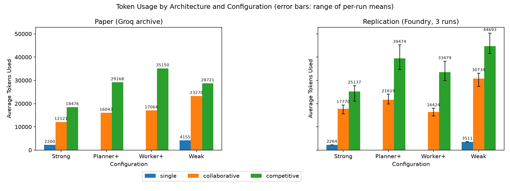

## Summary

Three independent runs of the paper's 28 configurations (504 module results) on Azure AI
Foundry reproduce the paper's mutation-score (RQ2) and cost (RQ3) findings and its headline
coverage finding for the Competitive architecture. They do not reproduce its coverage findings
for the Collaborative architecture and for model size.

| Finding of the paper | Replicated | Paper | Replication (3 runs) |
|---|---|---|---|
| RQ1: Competitive coverage is near-complete in every configuration | yes (lowest 98.9%) | 99.7% to 99.9% | 98.9% to 99.8% |
| RQ1: Competitive coverage is at least Collaborative coverage everywhere | yes | 4 of 4 configurations | 4 of 4 configurations |
| RQ1: Multi-agent coverage exceeds Single-Agent coverage (Strong, Weak) | Competitive only | Collaborative 98.6 and 97.2 vs Single 97.2 and 91.4 | Collaborative 91.2 and 92.2 vs Single 95.9 and 97.1 |
| RQ1: Single-Agent coverage drops with the small models | no | 97.2 to 91.4 | 95.9 to 97.1 |
| RQ1: Collaborative coverage is lowest in Worker+ | no | 94.9 | 96.4 (lowest: Strong, 91.2) |
| RQ2: Mutation scores are far below coverage | yes | gap of 24.5 points or more | gap of 25.6 points or more |
| RQ2: Competitive has the highest mutation score in most configurations | yes | 3 of 4 | 4 of 4 |
| RQ2: Multi-agent mutation gains over Single-Agent are limited | yes | +8.9 and +6.2 points | +6.8 and +3.5 points |
| RQ3: Competitive is the most expensive architecture in every configuration | yes | 4 of 4 | 4 of 4 |
| RQ3: Multi-agent uses several times the Single-Agent tokens | yes | 5.5x to 8.4x | 7.8x to 12.7x |
| RQ3: Single-Agent with small models uses more tokens | yes | 2,200 to 4,155 | 2,264 to 3,511 |

The automated checks in [figures/summary.md](figures/summary.md) use a strict 99% bar for
"near-complete" and therefore record that finding as missed by 0.1 points (Weak, 98.9%).

* With the two models that Foundry serves with the paper's exact weights, the Single-Agent
  baseline matches the paper closely (Strong: coverage 95.9% vs 97.2%, mutation score 65.7%
  vs 66.5%, tokens 2,264 vs 2,200), so hosting on Foundry does not change model behaviour.
* The Collaborative difference comes from a failure tail, not from lower typical quality. In
  both data sets about 75% of collaborative module runs reach 100% coverage, but 19 of 288
  replication runs end below 60% coverage against 1 of 96 in the archive (Fisher's exact test,
  p = 0.03). The loop keeps no best-so-far suite, so when a fix step returns only the repaired
  tests, or an import error hides its traceback from the fixer, the suite collapses by the
  iteration cap. A single collapse moves a cell mean by several points, more than the paper's
  one-to-two-point margins between architectures.
* The small-model findings depend on the two substitutes. Maverick in particular is stronger
  than Scout, so the Weak configuration is not weaker here; the paper's own drop in Weak
  Single-Agent coverage comes from two module results (51% and 60%).
* The paper's Worker+ dip coincides with the temporary 97% re-plan rule. In both data sets,
  collaborative coverage is lower under that rule (93.3% archive, 90.4% replication) than under
  the 10-iteration, 100% rule (99.9% and 96.8%).
* Multi-agent token use is higher than in the paper because more collaborative loops run to
  the iteration cap, and because `gpt-5-nano` spends many reasoning tokens.
* A pilot on Groq's free tier ([Groq free tier](#groq-free-tier)) ran four gpt-oss
  configurations with the paper's exact models. The collaborative results match the paper and
  Foundry; the free tier's daily token limit stretches the 13 configurations that use
  `gpt-oss-20b` to about five days per run.

## What was reproduced

The paper (Coppola et al., SEAA 2026, [doi:10.1007/978-3-032-36590-3_35](https://doi.org/10.1007/978-3-032-36590-3_35)) compares a
Single-Agent baseline, a Collaborative multi-agent loop and a Competitive multi-agent loop for
Python unit-test generation on six modules (`data/input_code/d01`..`d06`), with four model
configurations (Strong, Planner+, Worker+, Weak) built from two large and two small models.

Its Figures 3, 4 and 5 are the mean line coverage, mutation score and token usage over every
module result of the experiments in each configuration and architecture.
[paper_figures.py](paper_figures.py) recomputes them from the archived results in
[`results/`](../results) and matches every published bar to within 0.1 percentage points and
1 token, so the archive is the paper's data and the same script can draw the replication's
figures. `tests/test_replication.py` keeps that check as a regression test.

## How the archived results were produced

The git history shows that the archive was produced by three code versions, none of which is
the current `HEAD`. The paper's "between 5 and 10" maximum iterations reflects this mix.

| Archived results | Modules | Collaborative loop | Competitive loop |
|---|---|---|---|
| Era A, 2026-01-18 to 01-23 | d01-d05 of all 28 configurations | up to 10 iterations, re-plan below 100% coverage | up to 10 iterations, re-plan below 100% |
| Era B, 2026-01-26/27 | `d06_complex_logic` appended to every results file | up to 5 iterations, re-plan below 97% | up to 5 iterations, re-plan below 100% |
| Era C, 2026-01-31 | all modules of 5 collaborative configurations, re-run | up to 5 iterations, re-plan below 97% | not applicable |
| `HEAD`, 2026-02-09 | none | up to 5 iterations, re-plan below 100% | up to 5 iterations, re-plan below 100% |

The evidence is in the archive itself: `d06_complex_logic.py` is the last entry of every
results file, era A runs reach 11 iterations while d06 and era C runs stop at 6, and nine
collaborative module runs stop between 97% and 99% coverage before the iteration cap, which
only the temporary 97% rule allows (commits `febe2b6`, `c020a6e`, reverted in `1426b53`).
Three of the four Worker+ collaborative runs are era C runs, so the paper's lower
Collaborative coverage in Worker+ may partly reflect that rule rather than the architecture.

The paper states that mutation testing considers only covered lines. The archive does not:
a `setup.cfg` with `mutate_only_covered_lines=true` existed for 74 minutes on 2026-01-16,
before any archived run, and every archived run has the same number of mutants per module
(27, 18, 57, 38, 57 and 129), which is only possible when all lines are mutated. The
replication mutates all lines, like the archive.

## Replication setup

The replication runs the repository code with two loop settings made configurable
(`agent.max_iterations`, which existing configs already declared, and `agent.target_coverage`)
and leaves prompts, agents, pytest, cleanup and mutation testing unchanged.
[run_foundry_replication.py](run_foundry_replication.py) runs each configuration with the
settings of its archive era (era A for d01-d05, era B for d06, era C for the five
re-run collaborative configurations), in isolated copies of the repository, and merges the
passes into one results file per experiment, as the authors did when they appended d06.

### Models

Models are served by Azure AI Foundry instead of Groq. Two of the paper's four models are
available there with the same open weights. The two small ones are not available to this
subscription: `gpt-oss-20b` has no serverless deployment in any region, Llama-4-Scout is a
Marketplace offer that the subscription's policy blocks, and there is no GPU quota for
managed compute.

| Paper model (Groq id) | Role in the paper | Foundry deployment | Match |
|---|---|---|---|
| GPT-OSS-120B (`openai/gpt-oss-120b`) | big | `gpt-oss-120b` | same model |
| Llama-3-70B (`llama-3.3-70b-versatile`) | big | `Llama-3.3-70B-Instruct` | same model |
| GPT-OSS-20B (`openai/gpt-oss-20b`) | small | `gpt-5-nano` | substitute |
| Llama-4-Scout-17B (`meta-llama/llama-4-scout-17b-16e-instruct`) | small | `Llama-4-Maverick-17B-128E-Instruct-FP8` | substitute |

The substitutes were chosen in two steps, before any multi-agent replication result was
looked at:

1. Single-agent calibration against the archived `single_gptoss20B` and `single_llamaScout17B`
   runs. For GPT-OSS-20B, `gpt-5-nano` matched the mutation score (69.9% vs 68.6%) and the
   reasoning-token profile (5,431 vs 6,316 tokens per module), while the non-reasoning
   `gpt-4.1-mini` used three times fewer tokens. For Scout, `Phi-4` matched the per-module
   coverage and mutation pattern best and `Llama-4-Maverick` matched the mean mutation score.
2. A developer-role check, because most calls in the multi-agent loops are developer calls.
   With the competitive developer prompt on all six modules, `Phi-4` imported the module
   under test by an invented name (`from library import *`) in 5 of 6 suites, copying the
   prompt's few-shot example, so pytest could not collect them; `Llama-4-Maverick` and
   `gpt-5-nano` used the required import in every suite. The archive rules this behaviour
   out for Scout, whose collaborative runs as sole developer reach 95-96% coverage, so
   `Phi-4` was rejected and Maverick, the same Llama 4 family with the same 17B active
   parameters, was used.

Calibration data is kept in [calibration/](calibration), including the three Phi-4
competitive runs completed before the switch.

### Protocol

* Same prompts, agents, cleanup of failing tests and mutation testing as the archive, with
  the archive's loop settings per era (see above).
* Temperature 0.2 for every model except `gpt-5-nano`, which only accepts its default of 1;
  each results file records the temperature actually sent per role.
* Three independent runs of the full grid (`foundry/rep1` to `rep3`); the paper averages over
  runs and modules, and so do the replication figures.
* Mutation scores that `get_mutation_metrics` discarded because of timed-out or suspicious
  mutants under parallel load were recomputed with the same function in a quiet
  workspace by [fill_missing_mutation.py](fill_missing_mutation.py), as the repository's
  `mutation_injection.ipynb` does. A final suite with 0% coverage cannot run at all, so it
  kills no mutant and is scored 0.

## Results

The paper's archive is on the left and the replication on the right; error bars span the
lowest and highest of the three per-run means. Single-panel versions in the paper's format,
all tables, the per-experiment means and CSV exports are in [figures/](figures)
(see [figures/summary.md](figures/summary.md)).







Each cell shows the paper's value, then the replication mean with the range of the three runs.

| Configuration | Architecture | Coverage % | Mutation score % | Tokens |
|---|---|---|---|---|
| Strong | single | 97.2, 95.9 (95.2 to 96.6) | 66.5, 65.7 (65.0 to 66.6) | 2,200, 2,264 (2,229 to 2,304) |
| Strong | collaborative | 98.6, 91.2 (88.3 to 93.8) | 67.4, 65.5 (62.0 to 68.0) | 12,121, 17,770 (15,617 to 19,400) |
| Strong | competitive | 99.9, 99.7 (99.4 to 99.9) | 75.4, 72.5 (69.6 to 74.3) | 18,476, 25,137 (21,095 to 27,735) |
| Planner+ | collaborative | 97.7, 96.4 (95.2 to 97.3) | 70.8, 65.9 (65.3 to 67.1) | 16,043, 21,619 (19,854 to 24,021) |
| Planner+ | competitive | 99.7, 99.8 (99.6 to 99.9) | 66.6, 71.3 (66.9 to 75.4) | 29,168, 39,474 (34,640 to 45,239) |
| Worker+ | collaborative | 94.9, 96.4 (96.0 to 96.8) | 64.4, 64.0 (62.7 to 65.2) | 17,064, 16,424 (14,679 to 17,998) |
| Worker+ | competitive | 99.7, 99.8 (99.6 to 99.9) | 72.9, 69.8 (68.6 to 70.4) | 35,150, 33,479 (29,834 to 38,232) |
| Weak | single | 91.4, 97.1 (96.6 to 97.5) | 64.9, 64.9 (63.1 to 66.5) | 4,155, 3,511 (3,459 to 3,608) |
| Weak | collaborative | 97.2, 92.2 (86.8 to 96.8) | 67.3, 61.9 (60.7 to 63.2) | 23,270, 30,734 (27,362 to 33,081) |
| Weak | competitive | 99.8, 98.9 (97.2 to 99.8) | 71.0, 68.5 (65.3 to 71.7) | 28,721, 44,693 (41,561 to 50,351) |

The Strong row uses the paper's exact models; the other rows include at least one substitute.
The paper's value lies inside the replication's run-to-run range for 3 of 10 coverage cells,
5 of 10 mutation cells and 2 of 10 token cells. With three runs the range is narrow, so this
is a strict test.

### Why the Collaborative results differ

The bulk of the collaborative results agrees with the archive; the tail does not.

| Share of module results | Module results | 100% | 90-99% | 60-89% | 1-59% | 0% |
|---|---|---|---|---|---|---|
| Collaborative, paper | 96 | 76.0 | 13.5 | 9.4 | 1.0 | 0.0 |
| Collaborative, replication | 288 | 75.3 | 13.9 | 4.2 | 4.2 | 2.4 |
| Competitive, paper | 48 | 85.4 | 14.6 | 0.0 | 0.0 | 0.0 |
| Competitive, replication | 144 | 88.9 | 10.4 | 0.7 | 0.0 | 0.0 |

The collapses come from two properties of the original loop. The fix prompt asks the
developer to "fix only the failing tests", and the loop replaces the whole suite with the
answer, so a developer that returns only the repaired tests discards the rest. And when
pytest fails at collection, the error is on stdout while the fixer only receives stderr, so an
invented import (`from library import *`) or a missing package (`freezegun`) is never repaired.
For example, in run 2, `collaborative_llama70B_llama70B` grew the `d03` suite from 14 to 67
passing tests while stuck at 98% coverage; at the tenth iteration the fix step returned a single
test and the run ended at the cap with an empty suite. Competitive selection keeps the valid
candidate when one developer fails, which is why its tail stays empty.

The loop settings of each archive era matter in both data sets:

| Collaborative loop setting | Paper runs | Paper coverage | Paper below 60% | Replication runs | Replication coverage | Replication below 60% |
|---|---|---|---|---|---|---|
| up to 10 iterations, re-plan below 100% (era A) | 55 | 99.9% | 0 | 165 | 96.8% | 5 |
| up to 5 iterations, re-plan below 97% (era B d06 and era C) | 41 | 93.3% | 1 | 123 | 90.4% | 14 |

### Deviations and caveats

* Models run on Azure AI Foundry instead of Groq. Two models have the paper's exact weights;
  serving details such as quantization can still differ between hosts.
* Two small models are substitutes (see [Models](#models)); `gpt-5-nano` runs at its fixed
  temperature of 1 instead of 0.2.
* The archive is one run per configuration and the replication three. Paper findings that
  rest on one-to-two-point differences are within the replication's run-to-run variation.
* `d06_complex_logic` contains a deliberate time trap: `datetime.now().hour` below 6 switches
  to night-time pricing, so tests that do not mock the clock pass by day and fail by night.
  Seven module evaluations that crossed midnight were re-run at daytime (`TZ=Asia/Tokyo`). The
  archive does not record when its modules were evaluated.
* Mutation testing under parallel load discarded 160 of 504 scores (timed-out or suspicious
  mutants); they were recomputed with the same function. Seven suites that cannot run were
  scored 0. Four suites keep erroring tests that the cleanup step does not remove, so mutmut
  cannot score them; scoring them 0 instead would lower collaborative cells by at most 1.8
  points and change no finding.
* Two passes stalled on requests that never returned, because LangChain disables the OpenAI
  SDK's 600 s timeout; they were stopped and re-run, and the factory now sets that timeout.
  One module failed on a response without token usage and was re-run; the agents now count
  such a response as 0 tokens with a warning. Every re-run is recorded in the results file
  under `replication.reruns`.

### Files

* `foundry/rep1` to `foundry/rep3`: one directory per run, with `results/` (the format of
  [`results/`](../results) plus `llm` and `replication` metadata) and the final test suites in
  `output_tests/`
* `calibration/`: the single-agent calibration runs and the Phi-4 multi-agent runs
* `figures/`: paper-format and comparison figures and `summary.md`; `paper_figures.py` also
  writes `cell_means.csv` and `per_experiment.csv`, which the repository's `.gitignore`
  excludes
* `groq/pilot`: the Groq free-tier pilot (see [Groq free tier](#groq-free-tier)), with the
  per-call logs in `llm_calls/` and the unfinished `collaborative_gptoss20B_gptoss20B` run in
  `partial/`

Each run also writes its experiment logs (`logs/` and `*.log`). They stay out of git because
they repeat the results files and name the Azure resource.

## Groq free tier

Groq, the paper's host, still serves both gpt-oss models in October 2026, including on its
free tier (upgrades to the paid Developer tier are currently unavailable), but it has retired
both Llama models. The free tier can therefore run the paper's exact `gpt-oss-20b`, which the
Foundry replication replaces with `gpt-5-nano`, but none of the Llama roles.

### Limits and client changes

The free tier allows each model 30 requests and 8,000 tokens per minute, and 1,000 requests
and 200,000 tokens per day. Three behaviours of the current service required changes to the
Groq client in [llm_factory.py](../src/agents/llm_factory.py):

* Output cap. Without `max_tokens`, Groq now stops `gpt-oss-20b` after 2,048 completion
  tokens; the planner spent them all on reasoning and returned no plan. The archive holds a
  single-agent answer of about 11,900 completion tokens, so the paper's runs did not have this
  cap. The client now requests the model's maximum of 65,536 tokens.
* Per-minute admission. Groq refuses a request (HTTP 413, "Request too large") when its prompt
  plus an estimate of its completion exceeds 8,000 tokens. The estimate follows the model's
  recent completions: after the `gpt-oss-20b` planner wrote a 15,208-token answer, a
  1,465-token prompt was refused as "Requested 16,673", and refusals continued for about
  three minutes. The client retries these refusals with a growing pause for up to 30 minutes.
* Long waits. The groq SDK gives up on rate-limit waits longer than 60 seconds. The daily
  limit refills continuously, about 8,300 tokens an hour, and a request waits until its prompt
  plus the completion estimate has refilled (Groq answered "Used 199996, Requested 4868. Please
  try again in 35m1s"). The client waits as long as Groq asks, up to 12 hours per call.

### Pilot

Four configurations ran once each with the paper's exact Groq models, the archive protocol and
`TZ=Asia/Tokyo` ([groq/pilot](groq/pilot)). Values are means over modules; Foundry is the mean of
its three runs, with `gpt-5-nano` in place of `gpt-oss-20b`.

| Experiment | Coverage % (paper / Foundry / Groq) | Mutation score % | Tokens per module |
|---|---|---|---|
| `single_gptoss20B` | 93.3 / 96.2 / 91.7 | 68.6 / 66.6 / 61.6 | 6,316 / 5,194 / 4,703 |
| `single_gptoss120B` | 97.3 / 97.7 / 81.5 | 68.8 / 70.4 / 54.2 | 2,560 / 2,660 / 2,769 |
| `collaborative_gptoss120B_gptoss120B` | 99.8 / 99.8 / 99.8 | 74.9 / 75.7 / 75.7 | 12,394 / 12,282 / 12,127 |
| `collaborative_gptoss20B_gptoss20B`, d01-d04 | 100.0 / 100.0 / 100.0 | 72.6 / 71.3 / 72.2 | 24,614 / 34,577 / 11,402 |

* With the same model on all three hosts, the collaborative loop gives the same coverage,
  mutation score and token use. On the four modules of `collaborative_gptoss20B_gptoss20B`
  that completed, the exact `gpt-oss-20b` matches the paper's mutation score to 0.4 points,
  in fewer iterations (one per module, against one to four in the archive).
* Each single-agent gap comes from one module, because a one-shot suite runs or fails as a
  whole. Groq's `single_gptoss120B` suite for d03 ends with a stray `"""` and does not compile
  (0%), and its `single_gptoss20B` suite for d05 keeps 54% after its 11 failing tests are
  removed; the paper's own `single_gptoss20B` suite for d06 had 44 failing tests (60%). On
  the other modules Groq's mutation scores are within about seven points of the paper's, above
  as often as below. One run of six modules cannot separate hosts at this level; the Foundry
  replication used three runs.
* One `gpt-oss-20b` fix call, for d05, reasoned until the 65,536-token cap without answering.
  That one call used a third of the model's daily tokens; the run then waited for the daily
  limit twice (35 and 13 minutes) and resumed after the first wait. The longest complete answer
  in the pilot had 15,208 tokens. The pilot was stopped during d05: the paper's 77,000 tokens
  for d05 and d06 of this configuration take about nine hours at the refill rate. Its four
  finished modules are in `groq/pilot/partial`.
* Six requests were refused as too large for the per-minute limit; each was admitted after
  one to three retries, eight waits and 7 minutes in total. No other call failed.

### What a full run on the free tier takes

The daily limit sets the pace. `gpt-oss-20b` has a role in 13 of the 28 configurations, and
splitting the archive's tokens per experiment by role gives about 0.9 million `gpt-oss-20b`
tokens per run of the grid: at least 4.6 days per run at 200,000 tokens a day, and two weeks
for three runs. Runaway answers like the one above add a third of a day each; setting
`llm.max_tokens` to 32,768 halves that cost. No complete answer in the pilot, and no
single-agent answer in the archive, came near that limit, but a lower cap also lowers the
token counts that RQ3 compares.

The other 15 configurations do not use `gpt-oss-20b`; their Foundry runs can be reused. Keeping
`gpt-oss-120b` on Foundry loses little, since its collaborative results are the same on both
hosts, and saves Groq's budget for `gpt-oss-20b`. The combined grid then uses the paper's exact
weights for three of its four models; only Llama-4-Scout stays substituted, by Maverick.

```bash
# The 13 configurations that use gpt-oss-20b, with that model on Groq (about five days per run).
python replication/run_foundry_replication.py --out replication/groq/rep1 --workers 1 \
    --timezone Asia/Tokyo --timeout 604800 --log-llm-calls \
    --map openai/gpt-oss-20b=groq:openai/gpt-oss-20b \
    --only $(ls configs/experiments | grep -i gptoss20b | sed 's/\.yaml$//')
# Complete the grid with the Foundry results of the other 15 configurations, then compare.
cp $(ls replication/foundry/rep1/results/*.json | grep -vi gptoss20b) replication/groq/rep1/results/
python replication/paper_figures.py --source "Paper (Groq archive)=results" \
    --source "Replication (Foundry, 3 runs)=replication/foundry/rep*/results" \
    --source "Replication (exact gpt-oss-20b on Groq)=replication/groq/rep*/results" \
    --out replication/figures_groq
python replication/llm_calls_report.py "replication/groq/rep1/llm_calls/*.jsonl"
```

Use one worker: the daily limit applies per model across the whole Groq organization, so
parallel passes only queue for it. The collaborative collapses of the Foundry replication (see
[Why the Collaborative results differ](#why-the-collaborative-results-differ)) cannot be
re-examined on Groq: all 19 involve a Llama model, 17 of them as the developer, and Groq no
longer serves Llama.

## Reproduce

```bash
source .venv/bin/activate
# One run of the grid (repeat with rep2, rep3); see --help for --only, --map and --protocol head.
# d06_complex_logic behaves differently between 00:00 and 06:00 local time, so pin daytime if needed.
python replication/run_foundry_replication.py --out replication/foundry/rep1 --workers 10 --timezone Asia/Tokyo
python replication/fill_missing_mutation.py --timezone Asia/Tokyo \
    --out replication/foundry/rep1 replication/foundry/rep2 replication/foundry/rep3
python replication/paper_figures.py \
    --source "Paper (Groq archive)=results" \
    --source "Replication (Foundry, 3 runs)=replication/foundry/rep*/results" \
    --out replication/figures
```

The Foundry deployments must exist under the names in the model table, and
`AZURE_OPENAI_ENDPOINT` must point at the resource (see the repository README). With a Groq
API key, a provider prefix routes a model back to the original host, for example
`--map openai/gpt-oss-20b=groq:openai/gpt-oss-20b`; see [Groq free tier](#groq-free-tier) for
the free tier's limits and the commands for a run with the exact `gpt-oss-20b`.
